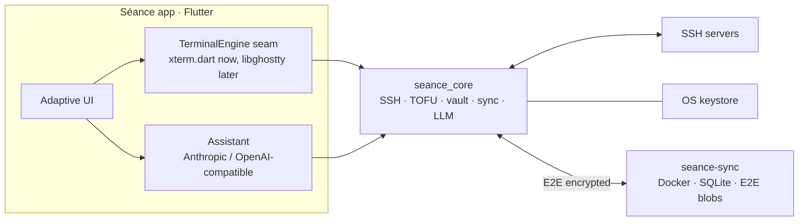

# AGENTS.md — working guide for Séance

!Important!

**Always pull the latest code from the repo before building.**

Read this first. It captures what isn't obvious from the code: how to get a
toolchain in a fresh environment, how to build/test each piece, the non-obvious
API constraints that shaped the code, and where the bodies are buried.

Séance is a personal cross-platform SSH client. Product design lives in
[PROPOSAL.md](PROPOSAL.md); current status and the next-steps checklist live in
[docs/STATUS.md](docs/STATUS.md). This file is the developer/agent guide.

## Repository layout

```
packages/
  seance_protocol/     pure Dart — models, E2E vault crypto, records, sync DTOs
  seance_core/         pure Dart — SSH, TOFU, sync client, LLM, config import
  seance_sync_server/  pure Dart — shelf API + SQLite storage + Dockerfile
app/
  seance_app/          Flutter — the cross-platform UI over seance_core
PROPOSAL.md            the accepted design document
```

`seance_protocol` is shared verbatim by both the client and the server, so the
wire format and conflict rules can never drift.

## Architecture



The terminal sits behind `seance_core`'s `TerminalEngine` interface. v1 uses
xterm.dart; libghostty drops in behind the same seam once it tags a stable
release (proposal §2, M10).

## Build & test

Requires the Dart SDK (3.12+) for the pure-Dart packages and the Flutter SDK
for the app. `scripts/build.sh` builds every target this host can build (the
native sync-server binary, the Docker image, the Flutter desktop app, and the
Android APK) and prints one summary; the individual commands:

```bash
# Everything this host can build (missing toolchains are skipped; explicitly
# named targets are mandatory and fail instead)
scripts/build.sh                # or: scripts/build.sh server docker
scripts/build.sh --install     # build + install the app for this host
                               # (macOS: /Applications/Séance.app) and reveal it

# Pure-Dart packages (crypto, SSH/TOFU, sync, LLM, server)
dart pub get
dart analyze packages/seance_protocol packages/seance_core packages/seance_sync_server
dart test    packages/seance_protocol packages/seance_core packages/seance_sync_server

# Flutter app (platform folders are committed; icons regenerate via
# `dart run flutter_launcher_icons` from media-sources/seance-icon.png)
cd app/seance_app
flutter pub get && flutter analyze && flutter test
flutter run -d linux    # or macos / windows / a device

# Sync server
docker compose -f packages/seance_sync_server/docker-compose.yml up -d --build
```

## Releasing & deploying

`scripts/release.sh` (a stub over the shared
[release-tool](https://github.com/L-K-M/release-tool) engine) bumps the
`version:` in all four pubspecs in lockstep, keeps the app lockfile and the
version line at the top of this README in step, commits, and tags `v<version>`
— pushing that tag triggers `.github/workflows/release.yml`, which tests, then
publishes the sync-server binaries, the `ghcr.io/l-k-m/seance` Docker image,
and the app for every client platform — Android APK, Linux/macOS/Windows
desktop bundles, and an unsigned iOS IPA (re-sign to sideload) — as the
GitHub Release. The desktop bundles are unsigned (macOS: ad-hoc), so first
launch needs the usual unidentified-developer step; `scripts/build.sh` stays
the local path for a signed-for-this-Mac build.

```bash
scripts/release.sh 0.2.0          # bump + commit, tag v0.2.0
scripts/release.sh 0.2.0 --push   # …also push branch + tag (CI then publishes)
```

On a server that runs the sync server via Docker Compose, `./update.sh` pulls
the latest code and rebuilds + recreates the stack in one step.

## Verification

Everything security- or correctness-critical is covered by tests that run in CI
(`.github/workflows/ci.yml`):

- **181 Dart tests** across the three packages — crypto round-trips and
  wrong-key/tamper rejection, verifier independence, recovery-code corruption
  detection, TOFU decisions, the danger linter, paste sanitization, secret
  redaction, LLM request/response handling and the chat tool loop, **two-device
  sync convergence** (engine and end-to-end over real HTTP), the server
  endpoints, and the real SQLite backend.
- **Flutter widget tests** for the TOFU dialog, plus `flutter analyze` clean
  across the whole app.
- The server was also compiled to a native binary and smoke-tested with `curl`
  (register / login / push / pull / 401).

## Security model (summary)

- Vault key and server auth verifier are **independent** (Argon2id → HKDF with
  separate domains); the server stores only a salted hash of the verifier and
  never sees a key.
- Record payloads are sealed client-side; the sync server is a breach-tolerant
  blob store. Login is rate-limited; the protocol is versioned.
- The assistant treats terminal scrollback as untrusted (prompt-injection),
  gets no execution/file tools, and every suggested command passes a
  review-before-run gate and an independent danger linter.

See [PROPOSAL.md §7](PROPOSAL.md) for the full checklist and open questions.

## Name

Séance — you summon remote machines and talk to them.

---

## 1. Environment (nothing is pre-installed)

This repo was built in a container with **no Dart or Flutter SDK**. They are not
committed and do not survive a container reset, so re-install them first:

```bash
# Dart SDK (for the pure-Dart packages: protocol, core, server)
curl -sSL -o /tmp/dartsdk.zip \
  https://storage.googleapis.com/dart-archive/channels/stable/release/latest/sdk/dartsdk-linux-x64-release.zip
unzip -q /tmp/dartsdk.zip -d /opt
export PATH=/opt/dart-sdk/bin:$PATH   # dart 3.12.x

# Flutter SDK (for the app). Its bundled Dart must match the ^3.12 constraint.
git clone --depth 1 -b stable https://github.com/flutter/flutter.git /opt/flutter
export PATH=/opt/flutter/bin:$PATH
flutter --version                      # first run bootstraps Dart + engine

# libsqlite3 — only needed to RUN the server's SQLite backend / its test.
sudo apt-get update && sudo apt-get install -y libsqlite3-0
```

Facts about this environment:
- Outbound HTTPS goes through a proxy; pub.dev and the Dart archive are reachable.
- **Docker CLI is present but the daemon was NOT running** — `docker build`
  could not be exercised here. The Dockerfile is verified only by `dart compile
  exe` + a native-binary curl smoke test (see §4).
- Flutter runs as root and prints a "don't run as root" warning — harmless.

---

## 2. Repository shape

```
pubspec.yaml            pub WORKSPACE root — members are the 3 pure-Dart packages
packages/
  seance_protocol/      models, E2E vault crypto, record envelope, LWW, sync DTOs
  seance_core/          SSH+TOFU, ssh_config import, prober, sync engine/coordinator,
                        LLM providers + chat tools, stores, TerminalEngine seam
  seance_sync_server/   shelf API + storage (in-memory + SQLite) + Dockerfile
app/
  seance_app/           Flutter UI over seance_core — NOT a workspace member
docs/STATUS.md          what's done / tested / still open
```

`seance_protocol` is shared verbatim by client and server. `seance_core`
re-exports it, so app code imports only `package:seance_core/seance_core.dart`.

---

## 3. Build & test — exact commands

**Pure-Dart packages** (analyze/test take explicit paths on purpose — see §5):

```bash
export PATH=/opt/dart-sdk/bin:$PATH
dart pub get                                   # resolves the workspace
dart analyze packages/seance_protocol packages/seance_core packages/seance_sync_server
dart test    packages/seance_protocol packages/seance_core packages/seance_sync_server
```

**Flutter app:**

```bash
export PATH=/opt/flutter/bin:$PATH
cd app/seance_app
flutter pub get
flutter analyze          # must be clean
flutter test             # widget tests (TOFU dialog)
flutter run -d linux     # needs GTK/clang/ninja for a Linux desktop build
```

The platform folders (android/ios/linux/macos/windows) ARE committed — they
carry real configuration: the display name (`Séance` — AndroidManifest label;
macOS `CFBundleName`/`CFBundleDisplayName`, while `PRODUCT_NAME` stays ASCII
`Seance` because codesign fails on accented file names — scripts/build.sh
renames the signed bundle to `Séance.app` when staging/installing), the macOS
entitlements (network client + user-selected files; deliberately NO
`keychain-access-groups` — that restricted entitlement blocks ad-hoc-signed
builds from launching, so the keystore uses the legacy login keychain via
`MacOsOptions(usesDataProtectionKeychain: false)` instead, which also avoids
the -34018 error of the data-protection keychain), and the launcher icons. Icons regenerate from
`media-sources/seance-icon.png` via `dart run flutter_launcher_icons` (config
in `app/seance_app/flutter_launcher_icons.yaml`); the server favicon is
embedded in `packages/seance_sync_server/lib/src/favicon.dart` (regeneration
recipe in its header). Bundle ids are `com.lkm.seance_app` (Android) /
`com.lkm.seanceApp` (Apple).

**Sync server as a native binary (works without Docker):**

```bash
dart compile exe packages/seance_sync_server/bin/seance_sync_server.dart -o /tmp/seance-sync
SEANCE_OPEN_REGISTRATION=true SEANCE_BIND=127.0.0.1 SEANCE_PORT=8799 /tmp/seance-sync
```

**Docker** (build context MUST be the repo root so the workspace resolves):

```bash
docker build -f packages/seance_sync_server/Dockerfile -t seance-sync .
```

CI runs all of the above (`.github/workflows/ci.yml`): dart analyze+test,
flutter analyze+test, the Docker build, and a client build matrix that
compiles the app for android/linux/macos/ios/windows on their native runners
(the same matrix release.yml packages and publishes — keep the two in step).

**Helper scripts** (family conventions shared with the sibling repos):

- `scripts/build.sh` — builds every target this host can build (`server`,
  `docker`, `app`, `apk`); skips targets whose toolchain is missing, fails only
  on targets you name explicitly. Artifacts are staged into `dist/`;
  `--install` builds the host's app and installs it (macOS:
  `/Applications/Séance.app`; Linux: `~/.local/opt/seance`), then reveals the
  installed copy. `--help` prints the contract.
- `scripts/release.sh X.Y.Z [--push]` — stub over the shared
  [release-tool](https://github.com/L-K-M/release-tool) engine (`lkm-release`):
  bumps all four pubspecs in lockstep (+ app lockfile + README version line),
  commits, tags `v<version>`; the pushed tag triggers
  `.github/workflows/release.yml` (tests gate; publishes sync-server binaries,
  the GHCR Docker image, and all five app clients). Runs on macOS (BSD sed),
  like the engine.
- `./update.sh` — on a deployment host: pull the latest code, then
  `docker compose up -d --build` the sync server.

---

## 4. How things were verified (so you can re-verify)

- 181 Dart tests + 107 Flutter tests, all analyze clean.
- Sync correctness is proven two ways: `seance_core/test/sync_test.dart` (engine,
  two devices converge, concurrent-edit LWW, tombstones) and
  `seance_sync_server/test/integration_test.dart` (the real `HttpSyncClient` +
  `SyncEngine` against a live server over a socket).
- The server was compiled to a native binary and smoke-tested with `curl`:
  register → login (accept correct verifier, reject wrong) → push (assigns seq)
  → pull → unauthenticated 401.
- SQLite backend has its own test (round-trips + durability across reopen).

---

## 5. Gotchas that will bite you (learned the hard way)

- **`dart test` / `dart analyze` with no path** at the repo root tries to pull
  in `app/` (Flutter) and fails with "seance_app requires the Flutter SDK".
  Always pass the three package paths explicitly.
- **`pkill -f seance-sync` kills your own shell** — the pattern matches the
  bash command line running it (which contains "seance-sync"), so it SIGTERMs
  itself (exit 144). Kill by PID instead.
- **Background `&` + `kill` in one Bash call** was flaky in this harness; prefer
  a tracked background run or an explicit PID.
- The Flutter app is deliberately **not** in the root `workspace:` list (that
  would force `dart pub get` to need the Flutter SDK). It path-depends on the
  workspace members; that resolves fine even though they declare
  `resolution: workspace` (verified).
- Pure-Dart **Argon2id is slow** (19 MiB). Tests use `Argon2Params.fast()`;
  never use that in production.
- **file_picker ≥11 breaks the APK build** ("cannot find symbol:
  FilePickerPlugin" in GeneratedPluginRegistrant.java): on AGP 9+ the plugin
  stops applying the Kotlin plugin and expects AGP's built-in Kotlin, which the
  Flutter template disables (`android.builtInKotlin=false`).
  `app/seance_app/android/build.gradle.kts` re-applies Kotlin to that one
  subproject as a workaround — remove it once file_picker fixes
  [issue #1973](https://github.com/miguelpruivo/flutter_file_picker/issues/1973)
  or Flutter enables built-in Kotlin.

---

## 6. Library API constraints that shaped the code

Do not "simplify" these away — they are load-bearing:

- **`cryptography` 2.9 `Hkdf.deriveKey` has no `info` parameter.** Domain
  separation between the vault key and the auth verifier is done with distinct
  HKDF salts (`seance/v1/vault-encryption-key` vs `seance/v1/auth-verifier`).
  Argon2 `memory` is in KiB (19456 = 19 MiB). Sealed blob layout is
  `nonce(24) ‖ ciphertext ‖ mac(16)` via `SecretBox.concatenation()`.
- **Dart `RegExp` has no inline `(?i)` flag** — use `caseSensitive: false`. The
  password redaction rule uses a `(?<![A-Za-z0-9])` lookbehind so `DB_PASSWORD=`
  matches (underscore is a word char, so `\b` fails there).
- **dartssh2 `onVerifyHostKey(type, fingerprint)` gives the SHA-256 fingerprint
  string as bytes, NOT the raw host key.** That's why `HostKey` is identified by
  `fingerprintSha256`; `publicKeyBase64` is only known from a known_hosts import.
- **dartssh2 does not expose `SSHUserInfoRequest`** from its barrel — the
  keyboard-interactive handler lets the lambda parameter type be inferred.
- **dartssh2 has no local ssh-agent auth path.** `AuthMethod.agent` throws
  `UnsupportedError` in `SshSessionManager.connect` (see §7 gaps).
- **xterm 4.0**: `Terminal(maxLines:)`, settable `onOutput`/`onResize`,
  `write(String)`, `buffer.getText()`, `TerminalView(terminal, ...)`. SSH is
  bytes; the engine decodes UTF-8 leniently (`allowMalformed: true`).

---

## 7. The seams (extend here, don't fork)

- `TerminalEngine` (`seance_core`) — bytes in (`feed`), user input stream out,
  `resize`. xterm backend in the app (`XtermTerminalEngine`); libghostty is the
  intended future backend (proposal M10). `HeadlessTerminalEngine` is for tests.
- `ConfigStore` / `VaultStore` / `HostKeyStore` — in-memory (tests) and JSON-file
  (app) impls; SQLite/drift is the documented future swap.
- `SyncApi` (pull/push) — `HttpSyncClient` in prod, `FakeServer` in tests.
- `LlmProvider` — `AnthropicProvider` and `OpenAiCompatibleProvider` (the latter
  covers Ollama/LM Studio/etc. via `base_url`).
- Record model: `EncryptedRecord` is what the server sees (`kind` is *inside* the
  ciphertext); `DecryptedRecord` is app-side. Conflicts resolve by
  `Lww.resolve` = `(updatedAt, deviceId, seq)`; the server assigns `seq`.

---

## 8. Conventions

- Commit messages end with a co-author trailer and the session link, per repo
  convention. **Do not put a model identifier** in commits, code, or docs.
- Development happens on branch `claude/ssh-client-design-proposal-esejrg` and is
  also mirrored to `main`. Push with `git push -u origin <branch>` and retry on
  network errors.
- Keep new code matching the surrounding style: small focused files, doc
  comments that explain *why*, `analyze` clean before committing.
- The assistant (LLM) is intentionally **always on** (personal tool) — there is
  no enable/disable flag by design. Keep the safety invariants: review-before-run
  on generated commands, no execution/file tools in chat, default-on redaction,
  scrollback treated as untrusted.

---

## 9. Deliberate v1 deviations from the proposal

Both are behind interfaces and swappable without touching callers:
- Client crypto uses the pure-Dart `cryptography` package, not libsodium FFI.
- The app's local store is JSON files, not SQLite/drift (the *server* uses
  SQLite). Chosen to avoid `build_runner` codegen for v1.

See [docs/STATUS.md](docs/STATUS.md) for the full list of known gaps and the
prioritized next-steps checklist.
