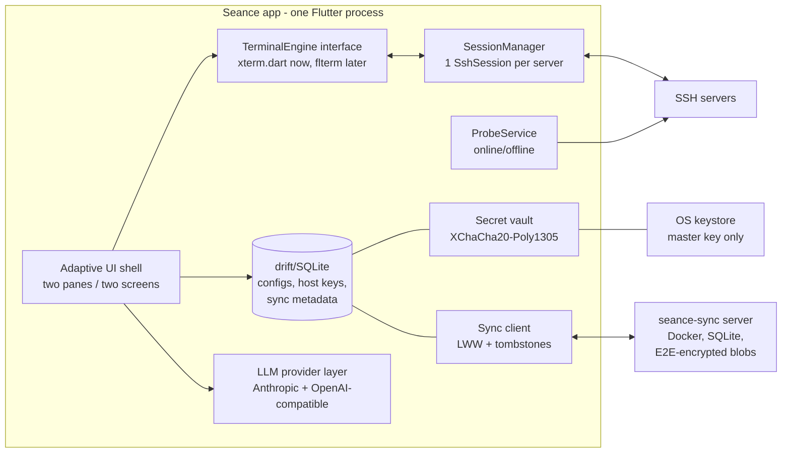

# Séance — Implementation Proposal

**Status:** Accepted (stack approved) · **Date:** 2026-07-07

Séance is a relatively simple cross-platform SSH client for personal use: a two-pane desktop app (server list with online/offline indicators on the left, terminal sessions on the right), configurable servers with password or private-key auth, an optional self-hostable sync server, and built-in LLM assistance. This document proposes an architecture, explains the trade-offs (including an honest assessment of the libghostty idea), and lays out a milestone roadmap.

**Decision log**

| Date | Decision |
|---|---|
| 2026-07-07 | Stack approved: Flutter/Dart as proposed (§4). |
| 2026-07-07 | Séance is a personal, single-user tool. The LLM assistant is a **core, always-on feature** — no off switch, no per-host opt-in (§6). |
| 2026-07-07 | Project named **Séance** (was Ghossht) — you summon remote machines and talk to them. Unaccented `seance` for identifiers, packages, and binaries; sync server binary `seance-sync`. |
| 2026-07-07 | The sidebar chat gets exactly two tools: **web search** and **paste-into-prompt** (which can never submit) — §6.3. |
| 2026-07-07 | **Implemented.** The monorepo (`packages/` + `app/`) realizes this design; see the root [README](README.md). Two deliberate v1 deviations, documented there: the client crypto uses the pure-Dart `cryptography` package (XChaCha20-Poly1305 + Argon2id) instead of libsodium FFI, and the local store is JSON files rather than SQLite/drift (SQLite is used by the sync server). Both sit behind interfaces and can be swapped without touching callers. |

---

## 1. Requirements recap

| # | Requirement | Notes |
|---|---|---|
| R1 | Desktop two-pane layout | Left: configured servers with online/offline dot. Click → SSH session in right pane. |
| R2 | Server configuration | Host, port, user; auth via password **or** private key. |
| R3 | Two-screen navigation | The two panes become two screens with back/forward navigation (see note below). |
| R4 | Sync (optional) | Self-hostable server, started with Docker; desktops and mobile sync server configs. |
| R5 | LLM integration (core) | Prompt → terminal command (reviewed before execution); sidebar chat with terminal-session context. Always on — this is a single-user personal tool. |

**Note on R3:** the original idea says "Linux: two-pane layout switches to two screens". This proposal implements it as one *adaptive layout*: wide window → two panes; narrow window → two screens with back/forward navigation. A per-platform default (`auto | twoPane | stacked`) lets Linux default to the stacked two-screen mode if that literal reading is intended — it is the same code path either way, and it is exactly what mobile needs later. This is a one-line configuration decision, not an architectural one.

**Implicit requirement:** R4 mentions mobile, so the architecture must have a credible path to iOS/Android even though v1 is desktop-only.

---

## 2. Research summary: the terminal question

The central technical decision is the embedded terminal, so the libghostty idea was researched first.

### 2.1 libghostty reality check (July 2026)

- What has actually shipped is **libghostty-vt** only: a zero-dependency (not even libc) C/Zig library for VT sequence parsing, terminal state (cursor, scrollback, resize-reflow, selection internals), and key/mouse input encoding. It compiles for macOS, Linux, Windows, and WASM.
- It does **not render**. No GPU renderer, no font shaping/rasterization, no widget. The promised "give us an OpenGL/Metal surface" renderer library from [Mitchell Hashimoto's announcement](https://mitchellh.com/writing/libghostty-is-coming) has not shipped; it is a roadmap item ([tracking discussion](https://github.com/ghostty-org/ghostty/discussions/9411)).
- The C API (`include/ghostty/vt.h`) is official but has **no tagged release and no stability guarantee** — the header itself warns the API is "definitely going to change". The functionality is battle-tested (it *is* Ghostty's core, and Ghostty is at 1.3.1 as of 2026-03-13); only the API surface is unstable.
- Full GPU-rendered embedding exists today only on Apple platforms via the GhosttyKit XCFramework — and that goes through an internal API (`ghostty.h` / `apprt/embedded.zig`) that Mitchell explicitly disavows as "not a good C API".
- The ecosystem around it is genuinely lively ([awesome-libghostty](https://github.com/Uzaaft/awesome-libghostty)): shipping SSH clients on every platform Séance targets (Echo, VVTerm, Spectty, Geistty on iOS; Quay on macOS; Chuchu on Android), and bindings for Rust, Go, Dart/Flutter ([elias8/libghostty](https://github.com/elias8/libghostty) + `flterm` 0.0.4), Node/WASM ([coder/ghostty-web](https://github.com/coder/ghostty-web), xterm.js-API-compatible), .NET, Swift.

**Conclusion:** building v1 *on* libghostty today buys risk, not saved work — you would still write your own renderer against an API that will break under you. The right move is to keep the terminal behind a thin internal interface and adopt libghostty **later**, once libghostty-vt tags a release (VVTerm, Echo and others prove the migration is realistic). The idea is honored at the right time instead of bet on at the wrong time.

### 2.2 What existing cross-platform SSH clients actually use

- **Electron/webview + xterm.js:** Termius, Tabby, Wave Terminal, electerm — the most battle-tested embedded terminal, but weak touch/IME support on mobile ([xterm.js#1101](https://github.com/xtermjs/xterm.js/issues/1101)).
- **Native per platform:** Secure ShellFish / La Terminal use SwiftTerm on iOS; Zed wraps `alacritty_terminal` in Rust; ConnectBot has its own JVM stack. Best fidelity, N codebases.
- **Flutter:** `xterm.dart` + `dartssh2` (both from terminal.studio, both MIT) is the **only shipped single-codebase desktop + mobile pairing** — the SSH wiring example is ~100 lines in the xterm.dart repo.

---

## 3. Architectures considered

Three full architectures were developed and scored independently through three lenses (solo-dev feasibility, end-user UX quality, technical risk):

| Architecture | Feasibility | UX quality | Risk | Total |
|---|---|---|---|---|
| **A. Flutter-first** — one Dart codebase, xterm.dart + dartssh2, libghostty later | **9** | 6 | 7 | **22** |
| **B. Rust core + Tauri v2 shell** — russh + xterm.js, UniFFI native shells for mobile later | 6.5 | 7 | **8** | 21.5 |
| **C. libghostty-centric native shells** — SwiftUI/GTK4/Compose/WinUI over a shared Rust core | 3.5 | **8** | 4 | 15.5 |

- **C** delivers the best end-state UX (real Ghostty fidelity on Apple platforms, fully native shells) but requires 4–5 UI codebases, a self-built grid renderer on Linux/Windows/Android (font shaping, emoji width, IME — exactly the quicksand mature terminal widgets exist to avoid), and maximum exposure to libghostty's unstable API. Wrong choice for "relatively simple".
- **B** is excellent engineering (everything valuable in Rust, every UI disposable) and the best desktop terminal fidelity today, but mobile becomes a second project: UniFFI + SwiftUI/SwiftTerm + Compose means two more UIs and a second terminal integration. Two load-bearing languages from day one.
- **A** is the shortest path to every stated requirement with one language and one codebase across all five platforms, and it keeps the libghostty door open through a deliberate seam. Its weaknesses (terminal fidelity below Ghostty, Flutter desktop polish, a slow-moving xterm.dart) are real but manageable — and smaller than the alternatives' weaknesses.

**Recommendation: Architecture A — Flutter-first**, with the best ideas grafted in from B and C (headless SSH test harness, conformance test rig, ssh-agent support in v1, latency benchmarks, zero-server sync v0).

---

## 4. Recommended architecture

### 4.1 Stack at a glance

| Concern | Choice | Why |
|---|---|---|
| UI | **Flutter 3.4x** (one codebase: macOS, Windows, Linux now; iOS, Android later) | Only proven single-codebase desktop+mobile path for this app shape |
| Terminal | **xterm.dart 4.x, vendored/forked**, behind an internal `TerminalEngine` interface | Proven with dartssh2; seam allows libghostty (`flterm`) swap later |
| SSH | **dartssh2 2.22+** (pure Dart, MIT, actively maintained — 2.22.0 released 2026-07-03) | Password + key auth (Ed25519/ECDSA/RSA), keyboard-interactive, PTY + resize, keepalives, port forwarding, jump-host chaining |
| Local data | **SQLite (drift)** for configs, pinned host keys, sync metadata | Boring, portable, testable |
| Secrets | **flutter_secure_storage 10.x** (OS keystore) holds a random 32-byte master key; secrets live in an **XChaCha20-Poly1305 vault** (libsodium via `sodium_libs`) inside the DB | No OS keystore is sufficient alone (Windows Credential Manager caps blobs at 2'560 bytes; headless Linux often has no Secret Service) |
| Sync server | Single static binary + SQLite + Docker `scratch` image, ~7 REST endpoints, E2E-encrypted blobs (client-side crypto) | Atuin's proven deployment shape; server is a dumb blob store |
| LLM | BYOK provider layer: **Anthropic Messages API + OpenAI-compatible Chat Completions** (covers Ollama/LM Studio/vLLM/OpenRouter via `base_url`) | Two wire protocols cover the whole market; local Ollama = the privacy story |

### 4.2 Component overview



### 4.3 UI shell and adaptive layout (R1, R3)

- A `LayoutBuilder` at the root selects the mode: above ~700 dp the app renders a two-pane `Row` (server list | terminal area); below, the server list is a full screen and tapping a server pushes the terminal as a `Navigator` route with standard back navigation.
- A `layoutMode` setting (`auto | twoPane | stacked`) overrides the breakpoint; Linux can default to `stacked` per R3's literal reading.
- Do **not** depend on `flutter_adaptive_scaffold` — it was discontinued 2025-04-30. The hand-rolled version is ~100 lines.
- The right pane hosts one tab per connected server (multiple concurrent sessions), each tab a `TerminalView` bound to a live session.
- State management stays boring: Riverpod (or plain `ChangeNotifier`) — no bespoke architecture.

### 4.4 Terminal engine seam

The whole app talks to a small internal interface, never to xterm.dart directly:

```dart
abstract interface class TerminalEngine {
  void write(Uint8List data);            // SSH channel → screen
  Stream<Uint8List> get output;          // keystrokes → SSH channel
  void resize(int cols, int rows);
  TerminalSelection? get selection;
  // theming, scrollback access for the LLM context feature, etc.
}
```

- **v1 backend:** vendored fork of xterm.dart (last release Feb 2024 — stable but slow-moving; vendoring is a deliberate maintenance decision, not an accident).
- **Future backend:** `flterm` / `libghostty-dart` (active, June 2026, but 0.0.x) once libghostty-vt tags a stable release. Ship it behind a setting, promote to default after burn-in.
- A **headless conformance rig** (see §8, M0) verifies any engine swap: SSH into a containerized sshd, run a scripted command matrix (vim, htop, wide chars, `yes`), assert on terminal grid contents. This makes "swap the engine" a mechanical, verifiable operation instead of a leap of faith.

### 4.5 SSH engine (R2)

dartssh2 wired directly to the terminal: `channel.stream → engine.write`, `engine.output → channel.sink`, resize → window-change request. Keepalives are built in (default 10 s) and double as session-health signals.

Details that are easy to get wrong and are therefore designed in from the start:

- **Host-key verification (TOFU):** dartssh2 exposes only an `onVerifyHostKey` callback — no known_hosts handling. Séance implements its own pinned-key store in SQLite: first connect shows a dialog with key type + SHA-256 fingerprint (copyable); a changed key is a **hard, visually distinct "HOST KEY CHANGED" block** requiring an explicit re-pin flow — never a one-click dismiss (Remmina's history shows how this goes wrong). Pinned keys sync, so a second device does not silently re-TOFU. Export to OpenSSH `known_hosts` format supported.
- **keyboard-interactive prompts:** many corporate servers require 2FA/TOTP mid-auth. dartssh2's `onUserInfoRequest` gets a real modal prompt flow in v1 — this is a launch blocker for real-world use, not a nice-to-have.
- **ssh-agent support in desktop v1** (`$SSH_AUTH_SOCK` on Unix, `\\.\pipe\openssh-ssh-agent` named pipe on Windows): this covers 1Password/Bitwarden agents, is exactly what the power users an SSH client attracts will demand, and — most importantly — means keys never enter Séance at all in the best case.
- **`~/.ssh/config` import:** a read-only import of `Host`/`HostName`/`Port`/`User`/`IdentityFile` blocks at first run. Days of work, and the single cheapest adoption lever for any new SSH client.
- **Protocol security:** verify dartssh2 implements strict key exchange (the Terrapin/CVE-2023-48795 countermeasure) during M2; if not, upstream a fix or document the gap. Establish a CVE-watch habit for the SSH dependency — a pure-Dart crypto stack gets less audit scrutiny than OpenSSL-family code.
- **Test matrix:** CI runs against a Docker matrix of sshd versions (old kex/ciphers included) so "works on my server" becomes "works on these documented server versions".

### 4.6 Online/offline probing (R1)

- `ProbeService` performs staggered, jittered TCP connects (30–60 s interval) to each configured `host:port`, reads the `SSH-2.0` banner to distinguish "port open" from "sshd alive", then disconnects. Connected sessions report online for free via keepalives.
- Indicator is **tri-state**: online / offline / **unknown** — hosts behind jump hosts, VPNs, or Tailscale may be unreachable to a direct probe yet perfectly alive; a binary dot would lie. Per-server probe opt-out included.
- Probing pauses when the app is hidden (and never runs in background on mobile). Defaults are conservative and documented: probes create sshd log entries and can trip fail2ban-style tooling if aggressive.

### 4.7 Local secrets (R2)

Three layers, because no single mechanism covers all platforms:

1. **Agent-first (best case):** keys stay in ssh-agent / 1Password / Bitwarden; Séance stores nothing.
2. **OS keystore stores only a random 32-byte vault master key** via flutter_secure_storage (macOS/iOS Keychain, Windows Credential Manager — whose 2'560-byte blob cap forbids storing actual keys, Android Keystore-wrapped AES, Linux libsecret).
3. **Encrypted vault** (XChaCha20-Poly1305, libsodium) inside the SQLite DB holds passwords and imported private keys. An optional master passphrase (Argon2id) is the fallback unlock for headless/keyring-less Linux — and doubles as the sync E2E key (§5).

Also supported: **reference, don't store** — point at an on-disk OpenSSH key file and prompt for its passphrase at connect. Encouraged default: generate a **per-device keypair in-app** with a one-click "deploy public key to server" (`ssh-copy-id`) action — this matches mobile hardware keystores later (which cannot export keys) and shrinks the blast radius of any single device.

Config rows never contain secret material — only references (auth type + vault entry id).

**Vault recovery is specified, not improvised:** if the OS keystore entry is lost (device migration, OS reinstall, code-signing change) and no passphrase was set, credentials are unrecoverable — so the UI actively nudges setting the passphrase/mnemonic when the vault first receives a secret, and the export file (§5) is the documented backup path.

---

## 5. Sync server (R4)

**Design principle: the server is a dumb, breach-tolerant blob store.** All crypto is client-side; the server never sees a key or a plaintext record. Modeled on [Atuin's](https://docs.atuin.sh/cli/self-hosting/server-setup/) proven self-hosting shape and [Bitwarden's](https://bitwarden.com/help/bitwarden-security-white-paper/) KDF design.

### 5.1 Sync v0 — no server at all

Before any server exists: **encrypted vault export/import** — one file (Argon2id + XChaCha20-Poly1305, key presented as a mnemonic), synced via the user's own git repo, Syncthing, or a USB stick (xpipe's model). This validates the record schema and every line of E2E crypto with zero protocol surface, gives multi-device users something immediately, and makes the server cuttable from v1 if the schedule demands.

### 5.2 The server

- **One static binary + embedded SQLite + Docker `scratch` image**; TLS via reverse proxy; TOML/env config with an `open_registration` toggle. `docker run` one-liner in the README.
- Written in **Dart** (`shelf`, `dart compile exe`) to keep the whole project one language and share the record-model + crypto package with the app verbatim — zero protocol drift. (Go + `modernc.org/sqlite` is the equally proven alternative if a separate language is acceptable; the API is small enough that this choice is not load-bearing.)
- **~7 endpoints, versioned from day one** (a `protocol_version` field in every request costs nothing now and is expensive to retrofit):
  - `POST /v1/register` (honors `open_registration`)
  - `POST /v1/login` → per-device bearer token
  - `GET /v1/sync?since=<seq>` — delta pull
  - `PUT /v1/records` — batch upsert of encrypted blobs + `{id, updated_at, deleted}`
  - `DELETE /v1/account`
  - `GET /healthz`
- **Login hardening:** rate limiting + Argon2id cost on the server-side verifier check — the login endpoint is an online oracle for brute-forcing the master passphrase and must be treated as such.

### 5.3 Crypto and conflict model

- Passphrase → **Argon2id** (≥ OWASP m=19456, t=2, p=1) → 32-byte vault key → **XChaCha20-Poly1305** per record with random 24-byte nonce. A **separate HKDF-domain-separated auth verifier** goes to the server (Bitwarden pattern) so the server never learns the vault key. Key shown as a mnemonic for enrolling new devices (Atuin UX).
- No invented crypto: consider adopting Atuin's exact PASETO v4.local + PASERK key-wrapping construction verbatim — it shrinks hand-assembled crypto to zero and buys cheap key rotation. Decide during M5; either way, all crypto lives in one shared package with published test vectors, and that package gets an **external review before sync GA**.
- **Conflicts: per-record last-write-wins** keyed by UUID, `(updated_at, device_id)` tiebreak, tombstones for deletes, server-assigned monotonic per-account `seq` for delta sync. SSH configs are small, rarely edited, and almost never edited concurrently — CRDTs and vector clocks are unjustified complexity here.
- **Policy:** non-secret config (host, port, user, auth type, key fingerprint) and pinned host keys sync by default; passwords and private keys sync **opt-in per item** inside the encrypted blob. Per-device keypairs remain the encouraged default — they never need to sync.

---

## 6. LLM integration (R5)

**Posture: core, always-on assistant in a single-user personal tool.** Séance is built for one user on their own machines, so the multi-tenant privacy scaffolding that public terminal products need (per-host opt-in, off switches, feature-flag separability) is deliberately dropped — the assistant is a first-class part of the app, always available.

What stays are the guardrails that protect the *user* from remote machines and from model mistakes — these are not backlash insurance, they are correctness:

- **Review-before-run stays absolute.** Generated commands are inserted editable into the prompt line; Enter executes. This matches the original product idea ("a prompt that can be turned into a command that can be executed") and is the only defense that works against both model error and prompt injection.
- **Scrollback is untrusted input.** A compromised or malicious remote server can embed instructions in command output (indirect prompt injection — OWASP's #1 AI risk in 2026, exploited in the wild). The chat therefore gets exactly two narrowly scoped tools (§6.3) — web search and paste-into-prompt — neither of which can execute anything, and any command it suggests goes through the same review gate.
- **Secret redaction stays on by default** — it protects your own keys and tokens from leaving the machine toward a cloud provider, which matters regardless of audience size. It is one global toggle (not per-host ceremony), and running against local Ollama makes the question moot entirely.

### 6.1 Provider layer

One small interface, exactly two implementations:

1. **Anthropic Messages API**
2. **OpenAI-compatible Chat Completions** — a configurable `base_url` covers Ollama, LM Studio, vLLM, OpenRouter, Groq. Local Ollama is the zero-cloud, zero-cost privacy story.

Configured as named modes `{provider, base_url, model, api_key_ref}` (Wave Terminal's pattern). API keys live in the OS keystore, referenced by name in config, and are **never synced**. Both protocols stream over SSE; the sidebar always streams.

### 6.2 Feature 1 — prompt → command

- Invoked by keybinding in the terminal. Sends a small host-context block (OS/distro from `/etc/os-release` cached at connect, shell, cwd, last command + exit code) + the user's prompt (~500 tokens).
- Response is structured JSON `{command, explanation, danger}` from a cheap model (Haiku-tier ≈ CHF 0.001/call).
- The command is inserted into the prompt line **editable — never auto-executed**. A client-side dangerous-pattern linter (`rm -rf /`, `dd of=/dev/*`, `mkfs`, `curl | sh`, fork bombs) warns independently of the model.

### 6.3 Feature 2 — sidebar chat with session context

- The sidebar is always available next to the active session, and session context is included **by default**: the last command block (via OSC 133 shell-integration marks where available — precise extraction instead of raw line counts), widening to the last ~200 lines or a selection with one click. The **context chip** remains as an affordance showing *what* is being sent, not whether.
- **Everything outbound passes the secret-redaction pass** (Warp-style regex set: cloud keys, tokens, JWTs, private-key blocks; user-extensible), and a **"what was sent" inspector** shows exactly what left the machine.

**Chat tools.** The chat gets exactly two tools:

1. **`web_search`** — for cloud backends, use the provider's native server-side web-search tool (both the Anthropic and OpenAI APIs offer one — zero extra infrastructure, results cited in the reply). For local/OpenAI-compatible backends (Ollama etc.), a client-side search tool backed by a configurable provider — self-hosted **SearXNG** fits the same Docker ethos as the sync server; the Brave Search API is the hosted alternative. Client-side search queries pass the same redaction filter as session context, and every query is rendered visibly in the chat transcript — so if injected content in scrollback or a fetched page tries to exfiltrate data through a search query, it is both redacted and visible.
2. **`paste_to_prompt`** — inserts a command into the terminal's input line but **can never submit it**. Three rules make "paste, don't run" actually true: (a) newlines/carriage returns are rejected — a pasted `\n` *is* an Enter, the classic paste-execution trap; (b) control characters are stripped (bracketed-paste-style sanitization); (c) the danger linter from Feature 1 runs on every paste. Executing remains a physical keypress by the user, always. Code blocks in chat replies get the same "insert into prompt" affordance.

Deliberately **not** given to the chat: command execution, file access, SFTP — nothing that acts on a machine without a user keypress.

### 6.4 Costs (BYOK, indicative)

Prompt→command on a Haiku-tier model: ≈ CHF 0.70–1/month at ~30 commands/day. Sidebar chat with ~8'000-token context: ≈ CHF 2–5/month on a small model, CHF 8–15/month on a Sonnet-tier model. CHF 0 with local Ollama. No billing infrastructure needed in v1.

---

## 7. Security posture (summary checklist)

- [ ] TOFU host-key store with hard-block on change; pinned keys sync; known_hosts export
- [ ] Strict-kex (Terrapin) verification of dartssh2 + documented CVE-watch process
- [ ] Agent-first auth; OS keystore holds only the vault master key; XChaCha20-Poly1305 vault; Argon2id passphrase fallback
- [ ] Vault recovery path specified (passphrase nudge + export file); no silent total-loss path
- [ ] Sync: client-side E2E, HKDF-separated verifier, versioned protocol, login rate limiting, external review of the crypto package before GA
- [ ] LLM: BYOK, default-on secret redaction of all outbound content (session context *and* search queries), chat limited to two tools — web search and non-executing paste (newline-rejecting, danger-linted) — review-before-run gate on every generated command; scrollback treated as untrusted input
- [ ] Terminal as attack surface: enable libghostty-vt-style paste-safety validation (bracketed-paste hijacking), constrain OSC 52 clipboard writes and title spoofing from remote servers

---

## 8. Roadmap

v1 = **desktop + LLM assistant + sync**. The assistant is core (decision log) and moves ahead of the sync server; the sync server remains cuttable from v1 because the file-based sync v0 covers multi-device until it ships. Mobile is post-v1.

| Milestone | Scope | Exit criterion |
|---|---|---|
| **M0 — Headless harness** (week 1) | dartssh2 against a Docker sshd matrix from a CLI/test rig — no GUI. Conformance rig skeleton: run commands, assert on terminal grid contents | Scripted session passes against 3 sshd versions |
| **M1 — Skeleton** (weeks 2–4) | Flutter app, adaptive two-pane shell, drift/SQLite server CRUD, secrets architecture in place from day one (keystore master key + vault) | Add/edit/delete servers; layout collapses correctly |
| **M2 — Terminal end-to-end** (weeks 4–7) | Vendored xterm.dart behind `TerminalEngine`, password auth, one live session, resize, copy/paste, TOFU dialog + HOST KEY CHANGED block, keyboard-interactive prompts | vim/htop usable; pathological-output benchmark (`yes`, `cat` a large file) meets a stated latency budget |
| **M3 — Core hardening** (weeks 7–11) | Private-key auth (incl. passphrase-protected files), ssh-agent, `~/.ssh/config` import, multi-session tabs, reconnect/backoff, ProbeService with tri-state indicator, per-device keypair generation + `ssh-copy-id` | All R1/R2 features complete on all three desktops |
| **M4 — Packaging + CI** (weeks 11–14) | GitHub Actions: signed/notarized dmg, msi, AppImage + Flatpak; sshd test matrix in CI; first external testers | One-command release build for all three desktops |
| **M5 — LLM assistant** (weeks 14–17) | Provider layer (Anthropic + OpenAI-compatible), prompt→command with danger linter + review gate, always-available sidebar chat with default session context, web-search + paste-to-prompt tools, redaction + inspector | Daily-drivable assistant against a cloud key and local Ollama |
| **M6 — Sync v0** (weeks 17–19) | Encrypted vault export/import file, mnemonic key UX — no server | Two devices exchange config via a git repo |
| **M7 — Sync server** (weeks 19–23) | Dart single binary + SQLite + Docker image, 7 versioned endpoints, LWW client engine, pinned-host-key sync, rate-limited login | `docker run` → two desktops syncing E2E-encrypted records |
| **M8 — v1.0 desktop** (weeks 23–26) | Polish, docs; Homebrew/winget/Flathub if wanted | v1 in daily use on all three desktops |
| **M9 — Mobile beta** (post-v1, ~6–8 weeks) | iOS/Android from the same codebase. Week 1 is a hard gate: soft-keyboard/IME/ctrl-esc input prototype. Reconnect-as-normal session model (designed in M3) carries the app-suspend lifecycle | TestFlight/Play beta |
| **M10 — libghostty adoption** (opportunistic) | When libghostty-vt tags a release and flterm matures past 0.0.x: second `TerminalEngine` backend, validated by the conformance rig, shipped behind a setting | Grid-level conformance with the xterm.dart backend |

---

## 9. Top risks and mitigations

| Risk | Mitigation |
|---|---|
| xterm.dart stagnation (last release Feb 2024) | Vendor the fork from day one; strict `TerminalEngine` seam; track flterm/libghostty-dart as the designated successor; conformance rig makes the swap verifiable |
| dartssh2 is the only credible pure-Dart SSH stack (single point of failure) | Pin versions; CI sshd matrix catches regressions; worst case is inheriting maintenance of a well-scoped protocol library — and the M0 harness means any replacement can be validated headlessly |
| Flutter desktop polish (IME, clipboard, text rendering on Windows/Linux) | Smoke tests on all three desktops from M2, not at packaging time; known issue class, budgeted as debugging time |
| DIY security surfaces (TOFU store, vault, sync crypto) | Zero custom primitives — libsodium + OWASP Argon2id params + Bitwarden/Atuin designs copied exactly; shared crypto package with test vectors; external review before sync GA |
| Mobile terminal input UX (the classic mobile-terminal failure mode) | Hard 1-week input prototype gate at the start of M9 before any store-release investment |
| Prompt injection via scrollback (and now via fetched web content) | Paste tool cannot submit — newlines rejected, control chars stripped, danger linter on every paste; search queries redacted and visible in the transcript; no execution or file tools; review-before-run gate on every suggested command |
| Solo-dev scope creep (5 platforms + server + LLM) | v1 gated on desktop + LLM + sync; sync ships file-based first so the server is cuttable; mobile is explicitly non-blocking; pre-authorized cut lines live in this document, not in a crunch-time decision |

**Deliberately not built (v1):** SFTP browser, port-forwarding UI, ProxyJump editor (import only), tmux integration, Mosh, OIDC on the sync server, LLM tools beyond §6.3's two (no execution, no file access), terminal tabs-within-tabs/splits.

---

## 10. Open questions

1. **R3 semantics:** confirm whether "Linux → two screens" meant literally Linux desktop or small/mobile screens; the implementation supports both via `layoutMode`, only the platform default changes.
2. **Windows priority:** the research says Windows users are plentiful but Flutter desktop is weakest there — is Windows a v1 blocker or a fast-follow?
3. **Sync server language:** Dart (one language, shared code) vs Go (conventional choice for tiny static binaries) — proposal says Dart; cheap to revisit before M7.
4. **Mosh/persistent sessions:** Echo (a direct competitor) ships SSH+Mosh; users notice on flaky links and mobile. Post-v1 candidate worth tracking.

(Naming is decided — **Séance**, see the decision log. The GitHub repository is still named `Ghossht` until renamed in the repo settings.)

---

## Appendix A — Key sources

- [Libghostty Is Coming — Mitchell Hashimoto](https://mitchellh.com/writing/libghostty-is-coming) · [libghostty cross-platform tracking](https://github.com/ghostty-org/ghostty/discussions/9411) · [libghostty-vt docs](https://libghostty.tip.ghostty.org/) · [ghostling (official minimal embed)](https://github.com/ghostty-org/ghostling) · [awesome-libghostty](https://github.com/Uzaaft/awesome-libghostty)
- [xterm.dart](https://github.com/TerminalStudio/xterm.dart) (+ in-repo [SSH example](https://github.com/TerminalStudio/xterm.dart/blob/master/example/lib/ssh.dart)) · [dartssh2](https://pub.dev/packages/dartssh2) · [flterm](https://pub.dev/packages/flterm) · [coder/ghostty-web](https://github.com/coder/ghostty-web)
- [Atuin self-hosted sync](https://docs.atuin.sh/cli/self-hosting/server-setup/) · [Atuin encryption scheme](https://blog.atuin.sh/new-encryption/) · [Bitwarden security whitepaper](https://bitwarden.com/help/bitwarden-security-white-paper/) · [xpipe git-based vault sync](https://docs.xpipe.io/guide/sync)
- [Warp secret redaction](https://docs.warp.dev/privacy/secret-redaction) · [iTerm2 AI plugin (separation rationale)](https://iterm2.com/ai-plugin.html) · [Wave AI modes (BYOK pattern)](https://docs.waveterm.dev/waveai-modes) · [Ollama OpenAI compatibility](https://docs.ollama.com/api/openai-compatibility)
- [flutter_secure_storage](https://pub.dev/packages/flutter_secure_storage) · [Windows credential blob size cap](https://learn.microsoft.com/en-us/windows/win32/api/wincred/ns-wincred-credentiala) · [OWASP password storage cheat sheet](https://cheatsheetseries.owasp.org/cheatsheets/Password_Storage_Cheat_Sheet.html) · [TOFU host-key UX](https://blog.g3rt.nl/ssh-host-key-validation-strict-yet-user-friendly.html)
- Prior art studied: Termius, Tabby (+ unmaintained tabby-web), Wave, Warp, xpipe, Remmina, Blink Shell, Secure ShellFish, VVTerm, Echo, Quay, Chuchu, OxideTerm, Zed's terminal, Atuin, Vaultwarden
