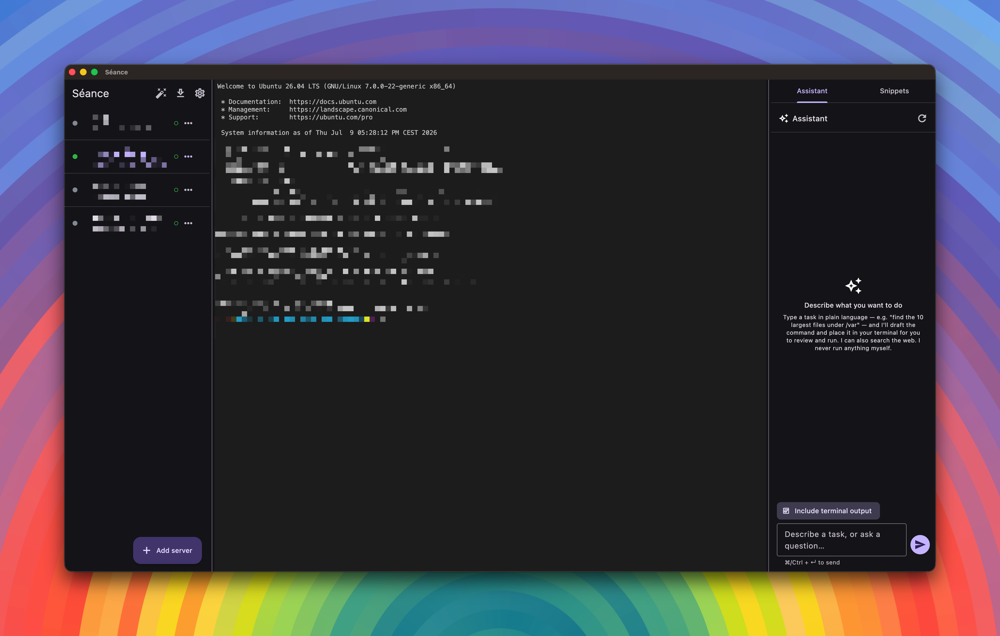

# Séance

A cross-platform SSH client for Mac and Android with an optional self-hostable sync server, a file browser, and a built-in LLM assistant.

*You summon remote machines and talk to them.*

**Latest release:** v<!-- version -->0.2.0<!-- /version --> · [Download](https://github.com/L-K-M/Seance/releases/latest)

This repository implements the design in **[PROPOSAL.md](PROPOSAL.md)** (read
that for the full rationale, alternatives considered, and roadmap).

## Features

- **Two-pane / two-screen UI** — servers with online/offline/**unknown**
  indicators on the left, terminal sessions on the right; collapses to
  back/forward screens on narrow layouts.
- **SSH** via [dartssh2](https://pub.dev/packages/dartssh2): password,
  private-key (stored or referenced-on-disk), and keyboard-interactive (2FA).
- **Trust-on-first-use host keys** with a hard, un-dismissable block when a
  pinned key changes.
- **Layered secret storage** — OS keystore holds a master key; passwords/keys
  live in an encrypted vault (XChaCha20-Poly1305, Argon2id).
- **Optional sync** — a self-hostable Docker server stores only end-to-end
  encrypted blobs and resolves conflicts by last-write-wins.
- **Built-in assistant** — natural-language → command (reviewed, never
  auto-run) and a session-aware chat whose only two tools are web search and a
  never-executing paste-to-prompt. Secret redaction is on by default; point it
  at local Ollama for a fully offline setup.
