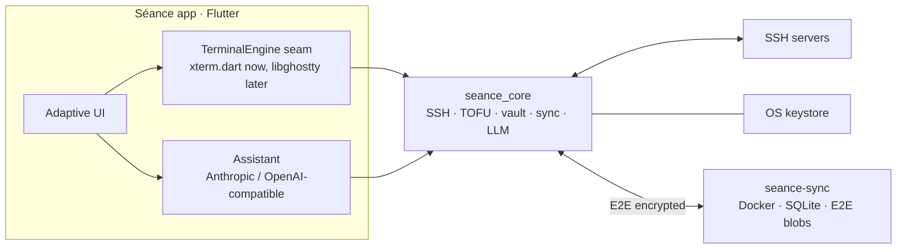

# Séance

A relatively simple **cross-platform SSH client for personal use**. Two-pane
server list + terminal on the desktop, adaptive two-screen navigation on narrow
screens, an optional self-hostable sync server, and a built-in LLM assistant.
*You summon remote machines and talk to them.*

This repository implements the design in **[PROPOSAL.md](PROPOSAL.md)** (read
that for the full rationale, alternatives considered, and roadmap).

## Features

- **Two-pane / two-screen UI** — servers with online/offline/**unknown**
  indicators on the left, terminal sessions on the right; collapses to
  back/forward screens on narrow layouts.
- **SSH** via [dartssh2](https://pub.dev/packages/dartssh2): password,
  private-key (stored or referenced-on-disk), and keyboard-interactive (2FA).
- **Trust-on-first-use host keys** with a hard, un-dismissable block when a
  pinned key changes.
- **Layered secret storage** — OS keystore holds a master key; passwords/keys
  live in an encrypted vault (XChaCha20-Poly1305, Argon2id).
- **Optional sync** — a self-hostable Docker server stores only end-to-end
  encrypted blobs and resolves conflicts by last-write-wins.
- **Built-in assistant** — natural-language → command (reviewed, never
  auto-run) and a session-aware chat whose only two tools are web search and a
  never-executing paste-to-prompt. Secret redaction is on by default; point it
  at local Ollama for a fully offline setup.

## Repository layout

```
packages/
  seance_protocol/     pure Dart — models, E2E vault crypto, records, sync DTOs
  seance_core/         pure Dart — SSH, TOFU, sync client, LLM, config import
  seance_sync_server/  pure Dart — shelf API + SQLite storage + Dockerfile
app/
  seance_app/          Flutter — the cross-platform UI over seance_core
PROPOSAL.md            the accepted design document
```

`seance_protocol` is shared verbatim by both the client and the server, so the
wire format and conflict rules can never drift.

## Architecture



The terminal sits behind `seance_core`'s `TerminalEngine` interface. v1 uses
xterm.dart; libghostty drops in behind the same seam once it tags a stable
release (proposal §2, M10).

## Build & test

Requires the Dart SDK (3.12+) for the pure-Dart packages and the Flutter SDK
for the app.

```bash
# Pure-Dart packages (crypto, SSH/TOFU, sync, LLM, server)
dart pub get
dart analyze packages/seance_protocol packages/seance_core packages/seance_sync_server
dart test    packages/seance_protocol packages/seance_core packages/seance_sync_server

# Flutter app
cd app/seance_app
flutter create --platforms=linux,macos,windows,android,ios --project-name seance_app .  # once, adds platform folders
flutter pub get && flutter analyze && flutter test
flutter run -d linux    # or macos / windows / a device

# Sync server
docker compose -f packages/seance_sync_server/docker-compose.yml up -d --build
```

## Verification

Everything security- or correctness-critical is covered by tests that run in CI
(`.github/workflows/ci.yml`):

- **82 Dart tests** across the three packages — crypto round-trips and
  wrong-key/tamper rejection, verifier independence, recovery-code corruption
  detection, TOFU decisions, the danger linter, paste sanitization, secret
  redaction, LLM request/response handling and the chat tool loop, **two-device
  sync convergence** (engine and end-to-end over real HTTP), the server
  endpoints, and the real SQLite backend.
- **Flutter widget tests** for the TOFU dialog, plus `flutter analyze` clean
  across the whole app.
- The server was also compiled to a native binary and smoke-tested with `curl`
  (register / login / push / pull / 401).

## Security model (summary)

- Vault key and server auth verifier are **independent** (Argon2id → HKDF with
  separate domains); the server stores only a salted hash of the verifier and
  never sees a key.
- Record payloads are sealed client-side; the sync server is a breach-tolerant
  blob store. Login is rate-limited; the protocol is versioned.
- The assistant treats terminal scrollback as untrusted (prompt-injection),
  gets no execution/file tools, and every suggested command passes a
  review-before-run gate and an independent danger linter.

See [PROPOSAL.md §7](PROPOSAL.md) for the full checklist and open questions.

## Name

Séance — you summon remote machines and talk to them. (The GitHub repository is
still named `Ghossht` until renamed in its settings.)
